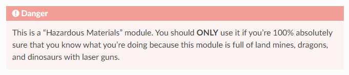

# Machine Problem 2

_By:_ \
_Diez, Reca Jane_ \
_Gonzales, Kyle Angelo_ \
_Pulvera, Eusib Vincent_

---

We were tasked to implement a program than encrypts and decrypts a message using RSA-OAEP with authenticity. In this discussion, we cover our approach to implementing our solution, a walk-through to using our code, and our insights and discoveries throughout this process.

Our initial strategy for this Machine Problem can be broken down into three parts:

1. Create functions to implement RSA-OAEP
2. Simulate the _encrypt-sign_ and _verify-decrypt_ schemes in the console
3. Create an end-to-end encryption chat app to simulate a more realistic transmission of an encrypted message over an insecure channel

### Implementing RSA-OAEP Functionality

We decided to use Python's [`cryptography`](https://cryptography.io/en/latest/hazmat/primitives/asymmetric/rsa) library. It contains low-level cryptographic primitives which allow us to implement security schemes using the concepts that we learned in class.

One intriguing aspect we observed was the meticulous attention to detail evident in the library's documentation, particularly in the cryptographic primitives section, which is aptly named `cryptography.hazmat`. Throughout this section, numerous warnings underscore the potential pitfalls and security risks inherent in misusing these cryptographic schemes. Such warnings serve as a reminder of the critical importance of proper implementation to avoid compromising the security of the application. Fortunately, the library provides layers of abstraction that simplify the implementation process while maintaining robust security measures.



Using the library, we implemented the RSA-OAEP scheme into several functions, which are described below:

#### `generate_keys()`

This function generates an RSA keypair (private key, public key). This function can also be used to generate a keypair for signing and verification.

Following the modular expnentiation:

```math
(m^e) \equiv \ \mod(n) \\
\text{where}\ n = pq
```

We selected a `public_exponent` ($e$) of 65537 (`0x10001`) as it is more secure against attacks compared to smaller exponents.
We also used the recommended `key_size` of 2048. This means that the modulus $n$ is 2048 bits long.

#### `encrypt(message, public_key)`

This function encrypts a message using RSA-OAEP encryption scheme.

In the Optimal Asymmetric Encryption Padding (OAEP) scheme, we use the `MGF1` scheme to generate a random symmetric key to scramble the message before encrypting the scrambled message and generated random key. Additionally, we use the `SHA-256` algorithm for the mask generation function.

#### `decrypt(ciphertext, private_key)`

This function decrypts a message using RSA-OAEP encryption scheme.

It also uses the same mask generation function (`MGF1`) and hash algorithm (`SHA-256`) with `encrypt()` for the OAEP scheme

#### `sign(ciphertext, signing_key)`

This function signs a message using RSA-PSS signature scheme.

It uses the Probabalistic Signature Scheme (`PSS`), which is the recommendeed padding scheme for RSA signatures. It uses the `MGF1` (which uses the `SHA-256` algorithm) and the max salt length.

#### `verify(signature, message, verification_key)`

This function verifies the signature of a message using RSA-PSS signature scheme.

It also uses the same `PSS` configuration as `sign()`.

### Console Simulation

We implemented a generic function to simulate the encryption-to-decryption process:

```python
#1. Generate Keys
private_key, public_key = generate_keys()
signing_key, verification_key = generate_keys()
def simulate_message_transmission(
    message,
    private_key,
    public_key,
    signing_key,
    verification_key,
):
    #2. Sending Message
    ciphertext = encrypt(message, public_key)  #2.1 Encrypt Message
    signature = sign(ciphertext, signing_key) #2.2 Sign Message
    #---------------------------------------------------#
    #3. Receiving Message
    if verify(signature, ciphertext, verification_key): #3.1 Verify Message
        message = decrypt(ciphertext, private_key) #3.2 Decrypt Message
        print(f"The message Is: {message}")
    else:
        print("Invalid signature.")
```

In order to further contextualize this simulation, consider the following situation:

1. Alice wants to send a message to Bob.
2. Bob generates a keypair for encryption-decryption. Alice generates a keypair for signing-verification.

   _Note: Though this was not implemented in the project, Alice's verification key and Bob's public key should be publicly available. These keys would typically be distributed via a trusted Certificate Authority or Public-Key Infrastructure. Additionally, Bob's private key and Alice's signing key are kept secret. These keys are typically stored in a secure keystore (e.g. [Azure Key Vault](https://azure.microsoft.com/en-us/products/key-vault))._

Now, we wanted to simulate different scenarios:

#### Scenario 1. Alice Successfully Sends a Message to Bob

In this scenario, Alice uses Bob's public key to encrypt the message, ensuring the confidentiality of the message. Then, Alice signs the ciphertext with her signing key to guarantee the integrity and authenticity of the message. Bob receives the ciphertext and signature. He uses Alice's verification key to ensure that the ciphertext indeed belongs to her. After verifying Alice's integrity and authenticity, Bob uses his private key to decrypt the message.

The scenario is described as code below:

```python
simulate_message_transmission(
    message,
    private_key,       # Bob's private key
    public_key,        # Bob's public key
    signing_key,       # Alice's signing key
    verification_key   # Alice's verification key
)
```

Simulation Output:

```
Kyle@JPC512 MINGW64 ~/OneDrive/2023-2024/CMSC 134/mp2 (main)
$ python main.py

Select Scenario:
1 - Ciphertext Sent and Received Successfully
2 - Digital Signature protects against Spoofing
3 - Encryption protects against Eavesdropping
4 - Quit
Input: 1

Input Message: Hello Bob! I can't wait for later tonight! xoxo  -Alice

Transmitting Ciphertext and Signature over channel...
Ciphertext (base-64):
WZZvAjkpjhbKZIieyfphKg4c0+WTw6DQRBVVvuSdzEUaomymzFAPi/t5BRvuFZ4ixJCAyvEVlogLD/qNpFexO9nLWLE5d+BWiToAAoXidolQ9uEgdF1rCxX9fM0RkHuDzoOZUB7WCkfSz9oyVjx89boW3WXagd4DNZA20E7pY/DzF02SfHF6V1Tflh76oZifmDykFhxT3Ay+stn9TGqraVuXoF+KyD587K3QNPXI2/JNfYB1E/xSQw8z/Zbo+dGnfEcjIVMtdW7dd8GBrcAm73Fg3Fv+c14LtU96GJHHzBin9axPONPz+XKedxe20UdqbiS3AElttuIg7s+VP52reQ==

Signature (base-64):
SVl4+YL5Ia/Pu9bD3fVgiICQBr9qcKzp0o6Jc8ZuUeYou/7BVEWido3O4ZzYnI1uVweX4283qD7KpmN6TTsQMcjJLNyG6cxm0YS351bc6SVqEZVr88LdJ9vN9LGj72y0oEf/L+YD5nQPV/WnGXbBj5RsUFEWU/Z3emthv8AWPBKHM8CORGp+zox8q2x/wOjnM1BHTBEeKzjRAYqHju9PPNSfcZQiZcFgwHYan9YmnUnC3U1psvyWC90fa4KG1Et2/0wQS9rp7XdWdvOs9uMIzfiveLOaQkKSntU46hLbQjdhpKOcyXgwRy1/k3DsFNTMyoQrDHtjoTwNTbbpR1zI0g==

The message Is: b"Hello Bob! I can't wait for later tonight! xoxo  -Alice"
```

Because we are using the OAEP scheme, encrypting the same plaintext would yield a different ciphertext as shown below. This elegant layer of entropy makes it significantly more difficult for attackers, further securing our message.

```
Input Message: Hello Bob! I can't wait for later tonight! xoxo  -Alice

Transmitting Ciphertext and Signature over channel...
Ciphertext (base-64):
dTrQV1TfhP38msqRGQpuxy7HkdCvoNKd01RhDhJ4AV5UtOqP6vIKnJ3U97yrce/bCAAorjUkC3O0h1jX0Fd96XBdDukvgomwZI/xqep7cGo7Xa/KKh5xvfQXx6ZyU80dVA2V7J146HbK1lHKd0lhQ3tHqmQTRUduF/CRZV8kCeOI09R8Yolo2+iHzm3+xqlp1UDOKSTh28rDrwE7NWAwFGKIaEAnyTTqVD5vkCaL92Xq14sq68Z1VkLyzu5mzcgo4UcZdry0z5mXDM3BIkXflJ6q53uhE190boKpz9/a3ficLhJXxfqmkwV3js5e/+Q3/rQv3o4kH8A9Imc4Fx9lbQ==

Signature (base-64):
f6bQDm4XNnbq64kgGUNbBHcn8KBWfvRQReWsy4MRjuAXSTl/Y2LPFHOmq6PPu9LCvh91mvDZ7DeHwltUWwSfJqkO79fLtd6aUoloiz4d3nv53ApM8Sv+DH4GsSOSuvw4IUXgqMVioXqA+QAfiTxjTz6RnYmPM7kvxw+qlixyf1WHKE0UkIRpOvy+vCXd1I7AEGdjoBCPkZjYZNLAusIBzBJ8Am3mGjidVXx5omkVnfV6PEe1CbDDKURXhYOCgDYhBXbk/Abto3d1bAnnLyUcsWksMh+joicuDAf/goh9ZaPJKGsPApK+Edef+0Tlkd+OKPgrJrYOKMGTC9Qid9fuJQ==

The message Is: b"Hello Bob! I can't wait for later tonight! xoxo  -Alice"
```

#### Scenario 2. Mallory Sends a Message to Bob Pretending to be Alice (Spoofing)

In this scenario, Mallory uses Bob's public key to encrypt the message. But, she isn't very familiar about digital signatures so she uses her signing key to generate a signature of the message. Mallory sends the message to Bob pretending to be Alice. When Bob receives a message, supposedly from Alice, he uses Alice's verification key to verify the signature. However, Bob realizes that the signatures don't match. He realizes that the message must not be from Alice. Bob discards the message.

The scenario is described as code below:

```python
simulate_message_transmission(
    message,
    private_key,       # Bob's private key
    public_key,        # Bob's public key
    bad_signing_key,   # Mallory's signing key
    verification_key   # Alice's verification key
)
```

Simulation Output:

```
Kyle@JPC512 MINGW64 ~/OneDrive/2023-2024/CMSC 134/mp2 (main)
$ python main.py

Select Scenario:
1 - Ciphertext Sent and Received Successfully
2 - Digital Signature protects against Spoofing
3 - Encryption protects against Eavesdropping
4 - Quit
Input: 2

Input Message: Hello Bob! This is definitely Alice. My grandmother got into a very bad accident and I need you to send me $6940 immediately. I'll pay you back. I promise -Alice

Transmitting Ciphertext and Signature over channel...
Ciphertext (base-64):
gVb+C0Vh9Hv26mwmEmsqNn3N4mZ9Q4egsgp9G/BaBFJa9TyViQ1tvIkV4P4UIvt4sinMkIUuyET5wuxH1XGxe8c7hmp8gFsuWtwFhNIs2rl/I2thkOBBlKa8sNvlN9nH13MqzPD3qhhHCP+dRw5+UrZfwytQ6ROUk/0cs6PZp0MUsL4pdwcxPTmTIrJn/De9BoJjYxWGWANcscx4tNtrzve6k7QslTi42zaItYAAEPJQJCyteByWaSyMx5ac8EzAXJxuBWVRHJQ3LMSvVVDdhd5688LHXOJ4fNy/oPQkNPitpuwNnOE6sp1rFXfzPJqQpJz1o7u9CHzTd1OsMQdlaQ==

Signature (base-64):
Wwjy8L5HO6u8ymF3qDSd6AAddSTRwTDNUrw+oI0odNQVlxga5bMA7GhP7OeU2YBqfDRxp/yXZ7Pdlha7OWoJfwNuUcwmAYqYgJKA/KwJS467cbOCLhy7R97yTYU49jqaEC3Sno6rg4KRCvzZieeKnkWMwKwOqS1jtMCBMx4Uhh8nVSmprcAM77KSmCuSIaC3Q99EGAZ3sFks8bMRouGW8BA48EuP7LLMzyylR+jc9fFQSnXs/3KJls69L4KDQsAuS8dmc2MOLXmbgz9M78tbF0qCKfI0Iy2CSkTe1cYyUT6aRFpx1wWuh8TEeGmCi16oyaHT53YNCvg8iIQC+wyKTQ==

Invalid signature.
```

#### Scenario 3. Eve Intercepts the Ciphertext from Alice

In this scenario, Alice uses Bob's public key to encrypt the message. Then, Alice signs the ciphertext with her signing key. However, during transmission, Eve intercepts the ciphertext and signature from Alice. She uses Alice's verification key to verify the signature. Then, Eve tries to decrypt the message with Bob's old private key. The decryption fails and she cannot obtain the original message.

```python
simulate_message_transmission(
    message,
    bad_private_key,   # Bob's OLD private key (used by Eve)
    public_key,        # Bob's public key
    signing_key,       # Alice's signing key
    verification_key   # Alice's verification key
)
```

Simulation Output:

```
Kyle@JPC512 MINGW64 ~/OneDrive/2023-2024/CMSC 134/mp2 (main)
$ python main.py

Select Scenario:
1 - Ciphertext Sent and Received Successfully
2 - Digital Signature protects against Spoofing
3 - Encryption protects against Eavesdropping
4 - Quit
Input: 3

Input Message: Hey Bob! I can't wait for tonight. Don't worry about Eve. She'll never find out. xoxo -Alice

Transmitting Ciphertext and Signature over channel...
Ciphertext (base-64):
vQDaxjkt83zpD7wpnn+Zo6KasIPkzGsSj+fMAGRrPW43u1oBZVabG78WqdZ2XzEWJeL/czhR1+V0wd3PkXfMXsWdIJr6s1yGs0xBzddQKcWY3rKMMc9JNiPgFubHh+UfobOHbC2pAvYouQMIkHUI2OkvCHB2gKpFf/ypHiEj7YD/62DwX4bGsGZDOUrhHx/Yxbrt+SgOsxN7KHD6/uBrT7EUQmjHD+7w04E1jG2ghIrCQtNJSjMg56sGPje4EP6+uwDjRk7ZpMInH7QfnOePSE0lHfdYVhwGjIBbzrpJIrmUCD/2Pi7CFlFnZEn2/f0xe29Gr8OxJ3t5uy124phiLQ==

Signature (base-64):
UhmTB6kHYc6ef2mU1m1rhH5WlRPl48XFNC3B2kPqF0ekb0C0ZusDuYozqqFSZTMDC+YvEQitHje37DcIN1naLI/XMTtL4JLKPZ5AhWU6BM2/6OAMVes6stkiFxLSLelVW8IcbPflujceytlQGwaFrfMQA60UsHZnIHcQHLkylP0wxknKORDk1PB2hfe7lsWBA4B1QrNZUbIH1h8N7z8FyyZX//L6fZJR7qulyDrDGNV7eFUlYW/RVai3zSls4tlr1pIbtfaICPxyuWdSiqQSX3xdCQ9jey03X+UAmGILlt6x6j3wLKEHWDVqnnWAzP8avv57y+co5C0ArQY8DwKydQ==

The message Is: HA! Your Private Key is Invalid! You cannot read this message.
```

In the `cryptography` library's implementation of the [`decrypt()`](https://cryptography.io/en/latest/hazmat/primitives/asymmetric/rsa/#decryption) function, if the `private_key` is incorrect, the function throws a `ValueError` stating that the `Decryption failed`. We found this interesting because we thought that the function would just output a random array of bytes. However, we learned that this was a design choice in order to protect the user from possible attacks.

#### Try It Yourself!

1. Clone the Repository
2. Open the `src` directory with `cd src`
3. Run `main.py` with `python main.py`

### Creating a chat app with end-to-end encryption

We didn't. It was a lot harder than we expected (who knew?!).

We initially wanted to build a simple client-server application with Python's Flask library. There would be exactly two clients that can communicate. We already implemented the cryptographic functionality in Python, as mentioned.

In our initial idea, the client sends a message over to the server, the server encrypts the message and broadcasts it to the other client. However, we realized that this would defeat the purpose of encryption, as we are sending the plaintext over the network. Additionally, the other client would also be receiving the message in plaintext because Flask renders the HTML pages on the server before sending it to the client (server-side rendering).

To resolve this, we realized we needed to use a client-side cryptography library that can encrypt and sign the message before it is transmitted. We attempted to use JavaScript's [`OpenCrypto`](https://github.com/safebash/opencrypto) library. However, we ran into another issue. We discovered that the Web Crypto API, which requires the `window.crypto.subtle` object is only available in secure contexts, which typically means when the webpage is served over HTTPS. This restriction is in place to ensure that cryptographic operations are performed securely, protecting sensitive data from potential attackers.

### Conclusion

In conclusion, our investigation in this Machine Problem highlighted several important lessons in cybersecurity. Through the process of implementing RSA-OAEP encryption and RSA-PSS digital signatures, we gained a deeper understanding of fundamental cryptographic concepts such as key generation, encryption, decryption, signing, and verification.

Firstly, we learned the value of leveraging established cryptographic libraries like Python's `cryptography`. These libraries are developed and maintained by experts. They have layers of abstractions and robust implementations to prevent accidental misuse and they have additional security measures that protect sensitive information (like in JavaScript's `OpenCrypto`).

Additionally, our exploration of randomness as a crucial tool in cybersecurity highlighted its role in generating unpredictable and unique values essential for cryptographic operations. Using padding schemes like OAEP for RSA encryption adds a layer of unpredictability and security.

Moreover, this project underscored the pivotal role of security in today's digital landscape. With threats to data privacy and integrity ever-present, adopting sound cryptographic practices is essential for safeguarding against unauthorized access and malicious manipulation. Overall, our Machine Problem experience underscored the significance of cryptographic best practices and reinforced the need for continual vigilance in the realm of cybersecurity.
